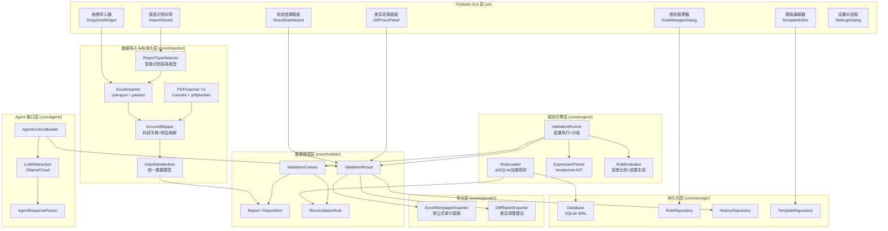
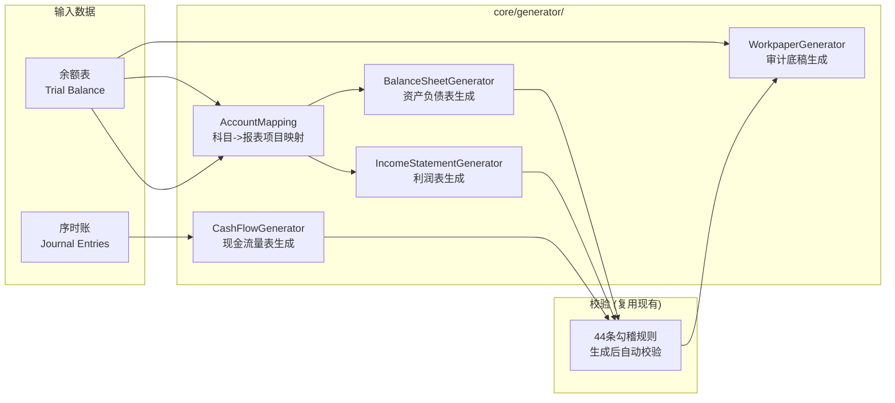

# 财务报表勾稽关系自动校验系统 - 设计文档

> **归档说明 (2026-08-15)**: 本文为历史设计/过程文档，其中规则数量、目录结构、依赖清单等具体数值可能与现行代码不一致；一切以根 AGENTS.md 与代码为准。


> **版本**: v1.0-draft  
> **日期**: 2026-08-07  
> **许可证**: MIT  
> **准则**: 中国企业会计准则 (CAS) 为默认，架构兼容 IFRS  
> **状态**: 调研与设计阶段（未开始编码）

---

## 目录

- [0. 文档说明](#0-文档说明)
- [1. 执行摘要](#1-执行摘要)
- [2. 第一性原理分析](#2-第一性原理分析)
- [3. 任务1：技术栈深度调研](#3-任务1技术栈深度调研)
- [4. 任务2：系统架构设计](#4-任务2系统架构设计)
- [5. 任务3：勾稽规则库设计](#5-任务3勾稽规则库设计)
- [6. 任务4：配置系统架构](#6-任务4配置系统架构)
- [7. 任务5：Agent接口预留设计](#7-任务5agent接口预留设计)
- [8. 任务6：项目结构与开发计划](#8-任务6项目结构与开发计划)
- [9. 对抗式审查记录](#9-对抗式审查记录)
- [10. 技术风险登记册](#10-技术风险登记册)
- [11. 参考来源](#11-参考来源)

---

## 0. 文档说明

本文档是"财务报表勾稽关系自动校验桌面软件"的完整调研与设计文档，覆盖用户要求的 6 项任务：技术栈调研、系统架构设计、勾稽规则库设计、配置系统架构、Agent接口预留设计、项目结构与开发计划。

**设计原则**：
1. **数据准确性第一** - 宁可漏报不可误报，容差默认偏宽容
2. **用户是财务人员** - 所有配置界面考虑易用性，非技术人员可操作
3. **数据敏感** - Agent 必须支持完全本地运行（本地 LLM），云端为可选
4. **CAS 为默认** - 架构兼容 IFRS，但 MVP 不实现 IFRS
5. **从第一性原理出发** - 每个设计决策都有明确理由，避免过度设计

**边界决策（用户已确认）**：
| 决策点 | 选择 |
|---|---|
| 许可证 | 开源 MIT |
| MVP 范围 | Excel-only + 三大主表 + 规则引擎 |
| PDF 时机 | MVP 不做，V1 做 Camelot + pdfplumber |
| Agent 时机 | MVP 仅预留接口，V1 接 Ollama |
| 合并/IFRS | MVP 只做 CAS 单体，合并/IFRS 预留 |

---

## 1. 执行摘要

### 1.1 项目定位

**GAP 定位**（基于 10 个现有项目的调研）：目前没有一款"离线、开源(MIT)、CAS 专用、确定性规则驱动、可审计可溯源、面向非上市中小企业自有 Excel 报表"的 Windows 桌面勾稽校验工具。本项目填补此空位。

### 1.2 技术栈一句话推荐

> **PySide6 + qfluentwidgets(Fluent Design UI) + pandas/openpyxl + 自研 AST 规则引擎(based on simpleeval) + SQLite(WAL)**

### 1.3 交付物

| 文件 | 说明 |
|---|---|
| `design.md` | 本文档 - 完整调研与设计 |
| `project_structure.md` | 项目目录结构、模块接口定义、分阶段开发计划 |
| `cas_gouji_rule_library.json` | CAS 勾稽规则默认库（44 条规则；v1.2.0 起调整为 37 条，v1.3.0 起为 42 条） |
| `DEV_LOG.md` | 开发日志 |

---

## 2. 第一性原理分析

### 2.1 问题的本质

财务报表勾稽校验的本质是：**给定一组报表数据，验证预定义的会计等式和逻辑关系是否成立**。

分解到最基本操作：
```
1. 取数：从报表中提取科目金额（a, b, c...）
2. 计算：对金额执行算术运算（a + b, a - b...）
3. 比较：比较计算结果是否相等（a == b + c）
4. 容差：考虑浮点误差和四舍五入（|a - (b+c)| < 0.01）
5. 报告：记录通过/失败 + 涉及科目 + 计算过程
```

**结论**：不需要 Rete 前向链推理引擎、不需要事件流处理、不需要 ML。核心是一个**安全的表达式求值器 + 容差比较器 + 结果记录器**，约 200 行代码。

### 2.2 最小必要复杂度

| 层 | 必要性 | 理由 |
|---|---|---|
| GUI | 必要 | 用户是财务人员，需可视化操作 |
| 数据导入与标准化 | 必要 | 不同企业报表格式不同，需统一映射 |
| 规则引擎 | 必要 | 核心价值，表达式求值 + 容差 |
| SQLite 存储 | 必要 | 规则库、历史记录、模板需持久化 |
| 科目字典映射 | 必要 | 桥接"企业科目名称"与"规则标准名称" |
| PDF 解析 | V1 | MVP 砍掉，V1 用 Camelot+pdfplumber |
| Agent 诊断 | V1 | MVP 预留接口，V1 接 Ollama |
| ML PDF 提取 | V2 | 扫描件/无边框表需要，V2 用 PaddleOCR |
| 合并报表 | V2+ | 合并抵销逻辑复杂，延后 |
| IFRS 支持 | V2+ | 双准则规则库，延后 |

### 2.3 过度设计反思

| 是否过度？ | 反思 |
|---|---|
| 自研规则引擎 vs 现成引擎 | **不过度**。所有现成引擎都不适合（不支持算术/范式错误/已废弃），自研 200 行反而更简单可维护 |
| SQLite vs PostgreSQL | **不过度选 SQLite**。500 规则 + 10K 历史 ≈ 4MB，WAL 模式 46 万查询/秒，单用户桌面完全够用 |
| Agent 接口预留 vs 立即实现 | **不过度**。仅 Protocol 类定义（~50 行），无实现代码 |
| qfluentwidgets vs 手写 QSS | **不过度**。qfluentwidgets 提供完整 Fluent Design 组件，避免手写 QSS 的维护负担 |
| 四层科目映射 vs 简单字典 | **MVP 不过度**。MVP 只用"别名字典 + 手动映射"两层；AI 语义匹配留到 V2 |

---

## 3. 任务1：技术栈深度调研

### 3.1 GUI 框架对比与推荐

#### 对比表

| 维度 | PySide6 ✅ | PyQt6 | Tauri v2 | Electron |
|---|---|---|---|---|
| 许可证 | **LGPL v3**（闭源免费） | GPL v3 或 **付费商业** | Apache-2.0 | MIT |
| 安装包大小 | 60-118 MB (裁剪后) | 同左 | 3-10 MB 外壳 + 50-90 MB Python sidecar | **243 MB** ❌ |
| 冷启动 | **2.1s** (onedir) | 同左 | 2-4s (sidecar) | 3.8s |
| 内存占用 | **52 MB** | 同左 | 40-70 MB | **184 MB** ❌ |
| Python 集成 | **原生 in-process** | 同左 | IPC (sidecar) ❌ | IPC (sidecar) ❌ |
| CJK 渲染 | **一流（系统字体+IME）** | 同左 | 良好（webview） | 良好（Chromium） |
| 现代 UI | qfluentwidgets / QSS | 同左 | HTML/CSS（最佳） | HTML/CSS（最佳） |
| 维护状态 | Qt 官方，活跃 | Riverbank，活跃 | 活跃 (110K★) | 活跃 |

#### 推荐：PySide6 + qfluentwidgets

**理由**：
1. **LGPL 免费** - PyQt6 的 GPL/商业许可对 MIT 项目是 deal-breaker
2. **pandas 原生集成** - in-process 调用，无 IPC 开销（Tauri/Electron 的致命弱点）
3. **体积/启动/内存全达标** - 60-118MB < 200MB 硬限，2.1s < 3s，52MB < 500MB
4. **CJK 一流** - 财务报表中文密集，Qt 原生字体处理优于 webview
5. **qfluentwidgets 解决"现代美观"** - 提供 Win11 Fluent Design 全套组件（CardInfoCard, Pivot, NavigationInterface 等），无需手写 QSS

**打包**：PyInstaller `--onedir`（裁剪 `--exclude-module PySide6.QtQml` 等未用模块），可选 Nuitka onefile（~65MB，更小但编译慢）。

**PyQt6 排除理由**：PyQt6 不提供 LGPL，仅 GPL v3 或 Riverbank 商业许可。在 MIT 项目中，GPL 依赖会导致整个项目被 GPL 感染。这是硬约束排除。

**Electron 排除理由**：243MB 安装包超出 200MB 硬限，184MB 内存接近 500MB 上限，且 Python 必须通过 IPC sidecar 调用 pandas，架构复杂化无收益。

**Tauri 排除理由**：虽然外壳仅 3-10MB，但 Python sidecar 仍需 PyInstaller 打包（50-90MB），且 pandas 数据必须跨进程传输（序列化 + IPC），对财务数据密集场景有性能和复杂度惩罚。

### 3.2 PDF 解析库对比与推荐

> **注意**：项目选择 MIT 许可证，因此 **PyMuPDF (AGPL-3.0) 被排除**。这是 licensing 决策的直接结果。

#### 对比表

| 库 | 许可证 | 财务表准确率 | 性能 | 依赖 | 维护 | 中文 |
|---|---|---|---|---|---|---|
| **Camelot** ✅ | MIT | 规则法最优(合并单元格/多级表头) | 中等 | 轻(pdfium) | 活跃 v2.0.0 | 良好 |
| **pdfplumber** ✅ | MIT | 文本提取优(F1 0.96)，表检测弱(F1 0.06) | 中等 | 无(纯Python) | 活跃 v0.11.10 | 良好 |
| PyMuPDF | **AGPL** ❌ | 快+CJK优，但合并单元格返回None | 最快(C) | 轻 | 活跃 | 优 |
| tabula-py | MIT | 检测F1 0.24(规则法最高) | 快(Java) | **需JRE** ❌ | 半活跃 | 良好 |
| pdf2htmlEX | - | N/A | - | 重 | **已归档** ❌ | - |

> **DocLayNet'24 基准**（arXiv 2410.09871）：所有规则法在财务表**检测** F1 ≤ 0.24，神经网络 TATR 达 0.79。这意味着 PDF 提取必然有错，**HITL 纠正 UI 是必需品**。

#### 推荐：Camelot(lattice) 主 + pdfplumber 辅 + PaddleOCR(Apache-2.0) 兜底(V2)

**分层策略**：
1. **V1 主力**：Camelot `lattice` 模式 - 擅长有表格线的财务报表，正确处理合并单元格和多级表头，直接输出 DataFrame
2. **V1 辅助**：pdfplumber - 文本层提取（科目名称、金额文本），Camelot 表格检测失败时的 fallback
3. **V2 ML 兜底**：PaddleOCR PP-StructureV3 (Apache-2.0) - 针对扫描件/无边框表，中文支持最佳
4. **必需**：HITL 纠正 UI - 展示提取结果，允许用户确认/调整表结构

**tabula-py 排除**：JRE 依赖使安装包膨胀 200MB+，部署复杂度不可接受。

### 3.3 规则引擎调研与推荐

#### 现成引擎全部排除

| 引擎 | 排除理由 |
|---|---|
| python-rule-engine | 只支持"字段 vs 常量"比较，**不支持算术** `A==B+C` ❌ |
| business-rules | 同上 + 2022年后停更 ❌ |
| PyKnow | CLIPS 范式 + 2018年停更 ❌ |
| experta (PyKnow fork) | CLIPS 范式 + 维护模式 ❌ |
| durable-rules | 事件流 CEP 范式（Rete 前向链），不适合批量表达式校验 ❌ |

#### 推荐：自研 AST DSL（基于 simpleeval）

**simpleeval**（MIT, 610★, 2026-08-07 活跃）是安全的 AST 白名单求值器：
- 支持算术：`+ - * / ** %`
- 支持比较：`== != < <= > >=`
- 支持自定义函数：`abs()`, `round()`
- **安全**：AST 白名单，非 `eval()`，无 `__import__`，无属性访问

**自研工作量**：~200 LOC（表达式解析 + 容差包装 + 规则元数据 + 结果生成）

**规则表达式示例**：
```
资产总计 == 负债合计 + 所有者权益合计
```
自动转换为：
```python
abs(资产总计 - (负债合计 + 所有者权益合计)) <= 0.01
```
用 simpleeval 安全求值，返回 `True/False`。

### 3.4 SQLite 容量评估

| 数据 | 量 | 大小 |
|---|---|---|
| 规则库 | 100-500 条 | ~0.5 MB |
| 历史记录 | 10,000+ 条 | ~3 MB |
| 模板 | 50+ 个 | ~0.25 MB |
| **合计** | | **~4 MB** |

**基准实测**：
- WAL 模式：462,251 查询/秒，11,641 写入/秒（simonw 基准）
- p99 读延迟 <6ms（60+ 并发 worker，50K 记录）

**结论**：SQLite 绰绰有余。配置 `PRAGMA journal_mode=WAL; PRAGMA busy_timeout=5000; PRAGMA synchronous=NORMAL`。规则元数据（type/severity/grouping）存为独立索引列，不依赖 JSON 列索引。

---

## 4. 任务2：系统架构设计

### 4.1 模块划分图



### 4.2 核心数据模型

```python
# core/models/report.py

from dataclasses import dataclass, field
from enum import Enum
from datetime import date
from typing import Optional

class ReportType(Enum):
    """报表类型"""
    BALANCE_SHEET = "balance_sheet"           # 资产负债表
    INCOME_STATEMENT = "income_statement"     # 利润表
    CASH_FLOW = "cash_flow"                    # 现金流量表
    EQUITY_CHANGES = "equity_changes"          # 所有者权益变动表
    NOTES = "notes"                            # 报表附注
    SEQUENCE_ACCOUNT = "sequence_account"      # 序时账
    TRIAL_BALANCE = "trial_balance"            # 余额表
    RELATED_PARTY = "related_party"            # 关联方采购表
    RECLASSIFICATION = "reclassification"       # 科目重分类表

class AccountingStandard(Enum):
    """会计准则"""
    CAS = "CAS"       # 中国企业会计准则
    IFRS = "IFRS"     # 国际财务报告准则
    SMALL_ENTERPRISE = "small_enterprise"  # 小企业会计准则

class PeriodType(Enum):
    """期间类型"""
    CURRENT = "current"      # 本期
    PRIOR = "prior"          # 上期
    BUDGET = "budget"        # 预算

class ConsolidationType(Enum):
    """合并口径"""
    STANDALONE = "standalone"   # 单体
    CONSOLIDATED = "consolidated"  # 合并


@dataclass
class ReportItem:
    """报表科目项 - 单个科目的标准化数据"""
    # 标识
    account_code: str                          # 科目编码 (如 "1001")
    account_name: str                          # 原始科目名称 (如 "货币资金")
    standard_name: str                         # 标准化名称 (如 "货币资金", 映射后)
    # 金额
    amount: float                              # 期末余额
    prior_amount: Optional[float] = None       # 期初余额 (上期期末)
    # 属性
    direction: str = "debit"                   # 借贷方向: debit/credit
    level: int = 1                             # 层级 (1=一级, 2=二级...)
    parent_code: Optional[str] = None          # 父科目编码
    is_subtotal: bool = False                  # 是否为小计/合计行
    # 元数据
    raw_row: int = 0                           # 原始Excel行号 (用于定位)
    raw_sheet: str = ""                        # 原始sheet名
    mapping_confidence: float = 1.0            # 映射置信度 (0-1)


@dataclass
class Report:
    """报表 - 一张完整的财务报表"""
    # 标识
    id: str                                     # UUID
    report_type: ReportType                     # 报表类型
    # 期间
    period_type: PeriodType                     # 本期/上期/预算
    fiscal_year: int                            # 会计年度 (如 2026)
    fiscal_period: int                          # 会计期间 (1-12, 0=年报)
    # 实体
    entity_name: str = ""                       # 企业名称
    consolidation: ConsolidationType = ConsolidationType.STANDALONE
    standard: AccountingStandard = AccountingStandard.CAS
    currency: str = "CNY"                       # 币种 (ISO 4217)
    # 数据
    items: list[ReportItem] = field(default_factory=list)
    # 来源
    source_file: str = ""                       # 原始文件路径
    source_sheet: str = ""                      # 原始sheet名
    imported_at: str = ""                       # 导入时间 ISO格式
    # 元数据
    template_id: Optional[str] = None           # 使用的模板ID
    notes: str = ""                              # 备注

    def get_item(self, standard_name: str) -> Optional[ReportItem]:
        """按标准名称获取科目项"""
        for item in self.items:
            if item.standard_name == standard_name:
                return item
        return None

    def get_amount(self, standard_name: str) -> Optional[float]:
        """按标准名称获取科目期末金额"""
        item = self.get_item(standard_name)
        return item.amount if item else None
```

```python
# core/models/rule.py

from dataclasses import dataclass, field
from enum import Enum
from typing import Optional

class RuleType(Enum):
    """规则类型"""
    INTRA_BALANCE = "intra_balance"        # 表内平衡 (A)
    INTER_RECONCILIATION = "inter_recon"    # 表间勾稽 (B)
    LOGICAL_REASONABLE = "logical"          # 逻辑合理性 (C)

class Severity(Enum):
    """严重级别"""
    ERROR = "error"        # 🔴 平衡破坏
    WARNING = "warning"    # 🟡 可能有问题
    INFO = "info"          # ⚪ 建议提示

class ToleranceType(Enum):
    """容差类型"""
    EXACT = "exact"            # 精确 (|diff| <= tolerance)
    ABSOLUTE = "absolute"      # 绝对容差 (|diff| <= tolerance)
    RELATIVE = "relative"      # 相对容差 (|diff| / base <= tolerance)
    THRESHOLD = "threshold"    # 阈值 (value > threshold)


@dataclass
class ReconciliationRule:
    """勾稽校验规则"""
    # 标识
    id: str                                    # 规则ID (如 "BS-BAL-001")
    name: str                                  # 规则名称 (中文)
    name_en: str = ""                           # 规则名称 (英文)
    description: str = ""                       # 规则说明
    # 分类
    rule_type: RuleType                         # 规则类型
    severity: Severity                          # 严重级别
    grouping: str = ""                          # 分组 (如 "balance_sheet", "inter_statement")
    # 表达式
    expression: str                            # DSL表达式 (如 "资产总计 == 负债合计 + 所有者权益合计")
    involved_fields: list[str] = field(default_factory=list)  # 涉及的标准科目名
    # 容差
    tolerance_type: ToleranceType = ToleranceType.EXACT
    tolerance: float = 0.01                     # 默认容差值
    # 适用范围
    standards: list[str] = field(default_factory=lambda: ["CAS"])  # 适用准则
    report_types: list[str] = field(default_factory=list)  # 涉及的报表类型
    # 元数据
    cas_ref: str = ""                           # CAS准则条文引用
    enabled: bool = True                        # 是否启用
    is_default: bool = True                     # 是否为默认规则
    created_at: str = ""
    updated_at: str = ""

    def to_dict(self) -> dict:
        """序列化为字典 (JSON存储用)"""
        return {
            "id": self.id,
            "name": self.name,
            "name_en": self.name_en,
            "description": self.description,
            "rule_type": self.rule_type.value,
            "severity": self.severity.value,
            "grouping": self.grouping,
            "expression": self.expression,
            "involved_fields": self.involved_fields,
            "tolerance_type": self.tolerance_type.value,
            "tolerance": self.tolerance,
            "standards": self.standards,
            "report_types": self.report_types,
            "cas_ref": self.cas_ref,
            "enabled": self.enabled,
            "is_default": self.is_default,
        }
```

```python
# core/models/result.py

from dataclasses import dataclass, field
from datetime import datetime
from typing import Optional, Any

@dataclass
class ValidationResult:
    """校验结果 - 单条规则的执行结果"""
    # 关联
    rule_id: str                                # 规则ID
    rule_name: str                              # 规则名称
    rule_type: str                              # 规则类型
    severity: str                               # 严重级别
    # 状态
    passed: bool                               # 是否通过
    # 数值 (用于差异展示)
    expected: Optional[float] = None             # 期望值 (等式右边)
    actual: Optional[float] = None               # 实际值 (等式左边)
    difference: Optional[float] = None           # 差异 (actual - expected)
    # 计算上下文 (用于差异追溯)
    formula: str = ""                           # 计算公式 (人类可读)
    expression: str = ""                        # 原始DSL表达式
    involved_items: list[dict] = field(default_factory=list)
    # involved_items 结构: [{"name": "资产总计", "value": 1000.00, "source": "BS!B5"}, ...]
    # 容差信息
    tolerance_type: str = "exact"
    tolerance: float = 0.01
    # 元数据
    timestamp: str = ""                         # 校验时间
    report_ids: list[str] = field(default_factory=list)  # 涉及的报表ID


@dataclass
class ValidationContext:
    """校验上下文 - 一次完整校验的上下文"""
    # 输入
    reports: dict[str, Any]                     # {report_type: Report} 或 {report_id: Report}
    rules: list[ReconciliationRule]              # 参与校验的规则列表
    settings: dict[str, Any] = field(default_factory=dict)  # 系统设置
    # 结果
    results: list[ValidationResult] = field(default_factory=list)
    # 统计
    total_rules: int = 0
    passed_count: int = 0
    failed_count: int = 0
    error_count: int = 0
    warning_count: int = 0
    info_count: int = 0
    # 元数据
    started_at: str = ""
    finished_at: str = ""
    duration_ms: int = 0                         # 耗时(毫秒)

    @property
    def pass_rate(self) -> float:
        """通过率"""
        if self.total_rules == 0:
            return 0.0
        return self.passed_count / self.total_rules
```

```python
# core/models/template.py

@dataclass
class ColumnMapping:
    """列映射 - Excel列到标准字段的映射"""
    column_letter: str       # Excel列号 (如 "B")
    column_name: str         # 列名 (如 "科目名称")
    field: str               # 映射到的标准字段 (如 "account_name", "amount", "prior_amount")


@dataclass
class ReportTemplate:
    """报表模板 - 定义如何从Excel提取数据"""
    # 标识
    id: str                    # 模板UUID
    name: str                  # 模板名称 (如 "标准资产负债表模板")
    report_type: str           # 报表类型 (ReportType.value)
    # Sheet配置
    sheet_name: str = ""       # sheet名 (空=第一个sheet)
    header_row: int = 1        # 表头所在行号 (1-based)
    data_start_row: int = 2    # 数据起始行号
    data_end_row: int = -1     # 数据结束行号 (-1=自动检测)
    # 列映射
    column_mappings: list[ColumnMapping] = field(default_factory=list)
    # 合并单元格处理
    merge_cell_strategy: str = "fill_down"  # fill_down / keep_first / skip
    # 多级表头
    multi_header: bool = False             # 是否多级表头
    header_rows: list[int] = field(default_factory=list)  # 多级表头行号列表
    # 小计/合计行识别
    subtotal_keywords: list[str] = field(default_factory=lambda: ["合计", "小计", "总计"])
    # 元数据
    description: str = ""
    created_at: str = ""
    updated_at: str = ""
    is_default: bool = False
```

### 4.3 数据流设计

```
用户拖入 Excel 文件
    │
    ▼
[1] 文件类型识别 ──────> .xlsx/.xls → ExcelImporter
                         .pdf → PDFImporter (V1)
                         .csv → CsvImporter
    │
    ▼
[2] 多 Sheet 拆分 ──────> 每个 Sheet 独立处理
    │                     (合并sheet / 母公司sheet 分别标记)
    ▼
[3] 报表类型识别 ──────> ReportTypeDetector:
    │                     - 关键词匹配 (sheet名/表头包含"资产负债表"等)
    │                     - 列结构匹配 (与已知模板对比)
    │                     - 用户确认 (不确定时弹窗)
    ▼
[4] 模板匹配 ──────────> 加载对应ReportTemplate
    │                     (无匹配 → 自动推断 → 用户确认 → 保存为新模板)
    ▼
[5] 数据提取 ──────────> 按模板配置提取:
    │                     - header_row 定位表头
    │                     - column_mappings 映射列
    │                     - merge_cell_strategy 处理合并单元格
    │                     - subtotal_keywords 识别小计行
    ▼
[6] 科目标准化 ────────> AccountMapper:
    │                     - 别名字典查找 (货币资金/现金/银行存款 → 货币资金)
    │                     - 模糊匹配 (difflib ratio > 0.8)
    │                     - 未匹配 → 标记 + 用户手动映射
    │                     - 记录 mapping_confidence
    ▼
[7] 构建 Report 对象 ──> Report + ReportItem 列表
    │                     (含期末/期初金额、原始行列定位)
    ▼
[8] 加载规则 ──────────> RuleLoader 从 SQLite 读取启用的规则
    │                     按 report_types 过滤适用的规则
    ▼
[9] 批量校验 ──────────> ValidationRunner:
    │                     for rule in rules:
    │                         values = extract_values(rule.involved_fields, reports)
    │                         expr = wrap_tolerance(rule.expression, rule.tolerance)
    │                         passed = simpleeval(expr, names=values)
    │                         result = build_result(rule, passed, values)
    │                     分组: 按rule_type + severity
    ▼
[10] 结果展示 ─────────> ResultDashboard:
    │                      - 红色: error (平衡破坏)
    │                      - 黄色: warning (可能有问题)
    │                      - 蓝色: info (建议)
    │                      - 点击 → DiffTracePanel (公式+涉及科目+原始行列)
    ▼
[11] 持久化 ──────────> HistoryRepository 保存校验结果到 SQLite
    │
    ▼
[12] 导出 ────────────> ExcelWorkpaperExporter (带公式审计底稿)
                        DiffReportExporter (差异调整建议清单)
```

### 4.4 规则引擎表达式语法 (DSL)

#### 4.4.1 表达式语法

```
<expression>  := <comparison>
<comparison>  := <arith> <op> <arith>
<op>          := "==" | "!=" | "<" | "<=" | ">" | ">="
<arith>       := <term> (("+" | "-") <term>)*
<term>        := <factor> (("*" | "/") <factor>)*
<factor>      := <number> | <field_name> | "(" <arith> ")" | <func_call>
<func_call>   := <func_name> "(" <arith> ("," <arith>)* ")"
<func_name>   := "abs" | "round" | "min" | "max"
<field_name>  := 中文字符/字母/数字/下划线 (如 "资产总计", "net_profit")
<number>      := 浮点数字面量
```

#### 4.4.2 表达式示例

```python
# 表内平衡
"资产总计 == 负债合计 + 所有者权益合计"
"营业利润 == 营业收入 - 营业成本 - 税金及附加 - 销售费用 - 管理费用 - 研发费用 - 财务费用"
"现金及现金等价物净增加额 == 经营活动净额 + 投资活动净额 + 筹资活动净额 + 汇率变动影响"

# 表间勾稽
"未分配利润期末 - 未分配利润期初 == 净利润"
"abs(货币资金期末 - 货币资金期初 - 现金净增加额) <= 0.01"  # 直接用比较

# 逻辑合理性
"毛利率 <= 1.0"                    # 毛利率不超100%
"abs(毛利率 - 上期毛利率) / 上期毛利率 <= 0.30"  # 同比波动<30%
"净利润 > 0 and 经营活动净额 < 0"   # 净利为正但现金流为负 (异常)
```

#### 4.4.3 容差自动包装

规则引擎在求值前自动将 `==` 表达式包装为容差比较：

```python
def wrap_tolerance(expression: str, tolerance: float, tolerance_type: ToleranceType) -> str:
    """将 == 表达式包装为容差比较"""
    if "==" not in expression:
        return expression  # 非等式，原样返回

    lhs, rhs = expression.split("==", 1)
    if tolerance_type == ToleranceType.EXACT or tolerance_type == ToleranceType.ABSOLUTE:
        return f"abs({lhs.strip()} - ({rhs.strip()})) <= {tolerance}"
    elif tolerance_type == ToleranceType.RELATIVE:
        return f"abs({lhs.strip()} - ({rhs.strip()})) / max(abs({rhs.strip()}), 0.01) <= {tolerance}"
    return expression
```

#### 4.4.4 安全求值

```python
from simpleeval import simple_eval, EvalWithCompoundTypes

# 允许的函数白名单
SAFE_FUNCTIONS = {
    "abs": abs,
    "round": round,
    "min": min,
    "max": max,
}

# 允许的运算符 (simpleeval默认已限制)
# 仅: + - * / ** % == != < <= > >= and or not

def evaluate(expression: str, names: dict[str, float]) -> bool:
    """安全求值 - AST白名单，非eval()"""
    try:
        result = simple_eval(
            expression,
            functions=SAFE_FUNCTIONS,
            names=names,
        )
        return bool(result)
    except Exception:
        # 求值失败 = 规则无法执行，标记为 WARNING
        return False
```

#### 4.4.5 热更新机制

```python
class RuleEngine:
    """规则引擎 - 支持热更新"""
    _rules: list[ReconciliationRule] = []
    _compiled: dict[str, Any] = {}  # {rule_id: compiled_expression}

    def reload(self) -> None:
        """从SQLite重新加载规则，无需重启"""
        self._rules = self._repo.fetch_all_enabled()
        self._compiled = {r.id: self._compile(r) for r in self._rules}

    def _compile(self, rule: ReconciliationRule):
        """预编译表达式 (解析AST，不执行)"""
        expr = wrap_tolerance(rule.expression, rule.tolerance, rule.tolerance_type)
        return expr  # simpleeval 在 evaluate 时解析AST
```

---

## 5. 任务3：勾稽规则库设计

### 5.1 默认规则清单

完整 44 条 CAS 勾稽规则已落盘至 `cas_gouji_rule_library.json`。分类汇总：

| 类别 | 数量 | 说明 |
|---|---|---|
| A. 表内平衡 | 16 | 资产负债表(5) + 利润表(5) + 现金流量表(4) + 所有者权益变动表(2) |
| B. 表间勾稽 | 14 | BS-IS(2) + BS-CF(1) + IS-CF(3) + SCE-IS(3) + SCE-BS(1) + IS-TAX(1) + NOTES(3) |
| C. 逻辑合理性 | 14 | 毛利率(2) + 资产负债率(1) + 净现比(2) + 周转率(2) + 波动(1) + 重分类(2) + 其他(4) |
| **合计** | **44** | |

### 5.2 规则数据结构 (JSON Schema)

```json
{
  "$schema": "http://json-schema.org/draft-07/schema#",
  "title": "ReconciliationRule",
  "type": "object",
  "required": ["id", "name", "rule_type", "severity", "expression"],
  "properties": {
    "id": {
      "type": "string",
      "pattern": "^[A-Z]+-[A-Z]+-[0-9]{3}$",
      "description": "规则ID，格式: 报表-类型-序号 (如 BS-BAL-001)"
    },
    "name": {"type": "string", "description": "规则名称(中文)"},
    "name_en": {"type": "string", "description": "规则名称(英文)"},
    "description": {"type": "string", "description": "规则说明"},
    "rule_type": {
      "type": "string",
      "enum": ["intra_balance", "inter_recon", "logical"],
      "description": "规则类型: A=表内平衡, B=表间勾稽, C=逻辑合理性"
    },
    "severity": {
      "type": "string",
      "enum": ["error", "warning", "info"],
      "description": "严重级别: error=平衡破坏, warning=可能有问题, info=建议"
    },
    "grouping": {"type": "string", "description": "分组 (如 balance_sheet, inter_statement)"},
    "expression": {
      "type": "string",
      "description": "DSL表达式",
      "examples": ["资产总计 == 负债合计 + 所有者权益合计"]
    },
    "involved_fields": {
      "type": "array",
      "items": {"type": "string"},
      "description": "涉及的标准科目名列表"
    },
    "tolerance_type": {
      "type": "string",
      "enum": ["exact", "absolute", "relative", "threshold"],
      "default": "exact"
    },
    "tolerance": {
      "type": "number",
      "default": 0.01,
      "description": "容差值 (exact/absolute: 金额; relative: 比率; threshold: 阈值)"
    },
    "standards": {
      "type": "array",
      "items": {"type": "string"},
      "default": ["CAS"],
      "description": "适用准则列表"
    },
    "report_types": {
      "type": "array",
      "items": {"type": "string"},
      "description": "涉及的报表类型列表"
    },
    "cas_ref": {"type": "string", "description": "CAS准则条文引用"},
    "enabled": {"type": "boolean", "default": true},
    "is_default": {"type": "boolean", "default": true}
  }
}
```

### 5.3 规则 JSON 示例

```json
{
  "id": "BS-BAL-001",
  "name": "资产=负债+所有者权益",
  "name_en": "Assets = Liabilities + Equity",
  "description": "资产负债表核心恒等式：资产总计必须等于负债合计加所有者权益合计",
  "rule_type": "intra_balance",
  "severity": "error",
  "grouping": "balance_sheet",
  "expression": "资产总计 == 负债合计 + 所有者权益合计",
  "involved_fields": ["资产总计", "负债合计", "所有者权益合计"],
  "tolerance_type": "exact",
  "tolerance": 0.01,
  "standards": ["CAS", "IFRS"],
  "report_types": ["balance_sheet"],
  "cas_ref": "企业会计准则--基本准则; CAS 30 财务报表列报",
  "enabled": true,
  "is_default": true
}
```

### 5.4 容差机制

| 容差类型 | 适用场景 | 默认值 | 示例 |
|---|---|---|---|
| `exact` | 精确等式（表内平衡） | 0.01 元 | `abs(A - (B+C)) <= 0.01` |
| `absolute` | 含调整项的勾稽 | 0.01 元 | `abs(A - B - 调整项) <= 0.01` |
| `relative` | 比率类合理性 | 0.30 (30%) | `abs(Δ毛利率/上期) <= 0.30` |
| `threshold` | 阈值类合理性 | 规则特定 | `毛利率 <= 1.0` |

**"宁可漏报不可误报"原则的体现**：
- 平衡类规则容差默认 0.01 元（1分），仅容忍浮点误差
- 合理性类规则默认阈值偏宽松（如波动>30%才报警，而非10%）
- 规则默认 `enabled=true` 但 `severity` 分级，error 级才阻断

### 5.5 分级与分类体系

```
分类维度
├── 按规则类型 (rule_type)
│   ├── intra_balance (A) - 表内平衡 [error 为主]
│   ├── inter_recon (B) - 表间勾稽 [error + warning]
│   └── logical (C) - 逻辑合理性 [warning + info]
│
├── 按严重级别 (severity)
│   ├── error (🔴) - 平衡关系破坏，必须修正
│   ├── warning (🟡) - 可能有问题，需关注
│   └── info (⚪) - 建议提示，供参考
│
├── 按报表分组 (grouping)
│   ├── balance_sheet - 资产负债表
│   ├── income_statement - 利润表
│   ├── cash_flow - 现金流量表
│   ├── equity_changes - 所有者权益变动表
│   ├── inter_statement - 跨表
│   └── notes - 附注
│
└── 按准则 (standards)
    ├── CAS - 中国企业会计准则
    ├── IFRS - 国际财务报告准则 (V2+)
    └── small_enterprise - 小企业准则 (V2+)
```

---

## 6. 任务4：配置系统架构

### 6.1 模板配置文件格式

```json
{
  "templates": [
    {
      "id": "tpl_bs_standard_v1",
      "name": "标准资产负债表模板",
      "report_type": "balance_sheet",
      "sheet_name": "资产负债表",
      "header_row": 3,
      "data_start_row": 4,
      "data_end_row": -1,
      "column_mappings": [
        {"column_letter": "A", "column_name": "科目编码", "field": "account_code"},
        {"column_letter": "B", "column_name": "科目名称", "field": "account_name"},
        {"column_letter": "C", "column_name": "期末余额", "field": "amount"},
        {"column_letter": "D", "column_name": "期初余额", "field": "prior_amount"}
      ],
      "merge_cell_strategy": "fill_down",
      "multi_header": false,
      "header_rows": [],
      "subtotal_keywords": ["合计", "小计", "总计"],
      "description": "适用于标准CAS格式资产负债表",
      "is_default": true
    }
  ]
}
```

### 6.2 规则配置文件格式

规则支持 JSON 导入导出：

```json
{
  "version": "1.0",
  "standard": "CAS",
  "exported_at": "2026-08-07T10:00:00+08:00",
  "rules": [
    {
      "id": "BS-BAL-001",
      "name": "资产=负债+所有者权益",
      "rule_type": "intra_balance",
      "severity": "error",
      "grouping": "balance_sheet",
      "expression": "资产总计 == 负债合计 + 所有者权益合计",
      "involved_fields": ["资产总计", "负债合计", "所有者权益合计"],
      "tolerance_type": "exact",
      "tolerance": 0.01,
      "standards": ["CAS"],
      "report_types": ["balance_sheet"],
      "cas_ref": "基本准则; CAS 30",
      "enabled": true,
      "is_default": true
    }
  ]
}
```

YAML 格式（V1 支持）：

```yaml
version: "1.0"
standard: CAS
rules:
  - id: BS-BAL-001
    name: "资产=负债+所有者权益"
    rule_type: intra_balance
    severity: error
    expression: "资产总计 == 负债合计 + 所有者权益合计"
    tolerance: 0.01
```

### 6.3 系统设置项清单

```python
@dataclass
class SystemSettings:
    """系统设置"""

    # --- 精度 ---
    decimal_precision: int = 2              # 小数精度 (2=分)
    rounding_mode: str = "half_up"          # 四舍五入模式

    # --- 币种 ---
    default_currency: str = "CNY"           # 默认币种
    currency_symbol: str = "¥"              # 货币符号
    exchange_rates: dict[str, float] = field(default_factory=dict)  # 汇率表

    # --- 会计准则 ---
    accounting_standard: str = "CAS"        # 默认准则
    consolidation_type: str = "standalone"  # 合并口径

    # --- 阈值 ---
    yoy_fluctuation_threshold: float = 0.30  # 同比波动阈值 (30%)
    mom_fluctuation_threshold: float = 0.30  # 环比波动阈值
    gross_margin_max: float = 1.0           # 毛利率上限
    debt_asset_ratio_warning: float = 0.70  # 资产负债率警告线
    debt_asset_ratio_critical: float = 1.0   # 资产负债率危险线
    cash_to_profit_ratio_min: float = 1.0   # 净现比最低值
    current_ratio_min: float = 1.0          # 流动比率最低值

    # --- 校验行为 ---
    strict_mode: bool = False               # 严格模式 (不容差)
    skip_disabled_rules: bool = True        # 跳过禁用规则
    parallel_execution: bool = True         # 并行执行规则

    # --- Agent/LLM ---
    agent_enabled: bool = False             # Agent诊断开关
    llm_provider: str = "ollama"            # LLM提供者: ollama / openai / anthropic
    llm_endpoint: str = "http://localhost:11434"  # LLM端点
    llm_model: str = "qwen2.5:14b"          # 模型名
    llm_api_key: str = ""                   # API密钥 (云端用)
    agent_auto_diagnose: bool = False       # 自动诊断 (发现差异自动调用)

    # --- UI ---
    theme: str = "light"                    # 主题: light / dark
    language: str = "zh_CN"                 # 语言
    result_page_size: int = 50             # 结果分页大小

    # --- 存储 ---
    db_path: str = "~/.fsa/data.db"         # SQLite路径
    history_retention_days: int = 365       # 历史保留天数
    auto_backup: bool = True                # 自动备份
```

### 6.4 配置持久化方案

| 配置项 | 存储位置 | 格式 | 热更新 |
|---|---|---|---|
| 规则库 | SQLite `rules` 表 | JSON blob + 索引列 | ✅ 无需重启 |
| 报表模板 | SQLite `templates` 表 | JSON blob | ✅ |
| 系统设置 | SQLite `settings` 表 | JSON blob | ✅ |
| 科目别名字典 | SQLite `account_aliases` 表 | KV 表 | ✅ |
| 历史记录 | SQLite `validation_history` 表 | 结构化 + JSON | - |
| 用户自定义规则 | SQLite `custom_rules` 表 | 同 `rules` 表 | ✅ |

**SQLite Schema 设计**：

```sql
-- 规则表
CREATE TABLE rules (
    id TEXT PRIMARY KEY,             -- 规则ID
    name TEXT NOT NULL,              -- 规则名称
    rule_type TEXT NOT NULL,         -- 规则类型 (intra_balance/inter_recon/logical)
    severity TEXT NOT NULL,          -- 严重级别 (error/warning/info)
    grouping TEXT,                   -- 分组
    expression TEXT NOT NULL,        -- DSL表达式
    involved_fields TEXT,            -- JSON数组
    tolerance_type TEXT DEFAULT 'exact',
    tolerance REAL DEFAULT 0.01,
    standards TEXT DEFAULT '["CAS"]', -- JSON数组
    report_types TEXT,               -- JSON数组
    cas_ref TEXT,
    enabled INTEGER DEFAULT 1,
    is_default INTEGER DEFAULT 1,
    description TEXT,
    created_at TEXT DEFAULT (datetime('now', 'localtime')),
    updated_at TEXT DEFAULT (datetime('now', 'localtime'))
);
-- 索引: 按类型+分组+启用状态过滤 (热查询路径)
CREATE INDEX idx_rules_type_grouping ON rules(rule_type, grouping, enabled);
CREATE INDEX idx_rules_severity ON rules(severity, enabled);

-- 历史记录表
CREATE TABLE validation_history (
    id TEXT PRIMARY KEY,             -- UUID
    run_at TEXT NOT NULL,            -- 执行时间
    entity_name TEXT,                -- 企业名称
    fiscal_year INTEGER,
    fiscal_period INTEGER,
    standard TEXT DEFAULT 'CAS',
    total_rules INTEGER,
    passed INTEGER,
    failed INTEGER,
    errors INTEGER,
    warnings INTEGER,
    infos INTEGER,
    duration_ms INTEGER,
    results_json TEXT,               -- 完整结果JSON (用于回溯)
    report_ids TEXT                  -- JSON数组
);
CREATE INDEX idx_history_run_at ON validation_history(run_at DESC);

-- 模板表
CREATE TABLE templates (
    id TEXT PRIMARY KEY,
    name TEXT NOT NULL,
    report_type TEXT NOT NULL,
    config_json TEXT NOT NULL,       -- 完整模板配置JSON
    is_default INTEGER DEFAULT 0,
    created_at TEXT DEFAULT (datetime('now', 'localtime')),
    updated_at TEXT DEFAULT (datetime('now', 'localtime'))
);

-- 科目别名字典
CREATE TABLE account_aliases (
    standard_name TEXT NOT NULL,     -- 标准名称 (如 "货币资金")
    alias TEXT NOT NULL,             -- 别名 (如 "现金及银行存款")
    confidence REAL DEFAULT 1.0,     -- 置信度
    PRIMARY KEY (standard_name, alias)
);
CREATE INDEX idx_aliases_standard ON account_aliases(standard_name);
CREATE INDEX idx_aliases_alias ON account_aliases(alias);

-- 系统设置表
CREATE TABLE settings (
    key TEXT PRIMARY KEY,
    value TEXT,                      -- JSON序列化值
    updated_at TEXT DEFAULT (datetime('now', 'localtime'))
);
```

---

## 7. 任务5：Agent接口预留设计

### 7.1 Agent 上下文数据结构

```python
# core/agent/context.py

from dataclasses import dataclass, field
from typing import Optional

@dataclass
class ViolationContext:
    """单条违规的上下文 (传给LLM)"""
    rule_id: str
    rule_name: str
    rule_type: str
    severity: str
    expression: str                      # 规则表达式
    formula: str                         # 人类可读公式
    expected: Optional[float]            # 期望值
    actual: Optional[float]              # 实际值
    difference: Optional[float]           # 差异
    involved_items: list[dict]           # 涉及科目 [{name, value, source}]
    tolerance: float
    cas_ref: str                         # 准则引用


@dataclass
class ReportSummary:
    """报表摘要 (传给LLM)"""
    entity_name: str
    fiscal_year: int
    fiscal_period: int
    standard: str                         # CAS/IFRS
    consolidation: str                    # 单体/合并
    report_types: list[str]               # 包含的报表类型
    key_metrics: dict[str, float] = field(default_factory=dict)
    # key_metrics: {"总资产": 1000000, "净利润": 50000, "毛利率": 0.35, ...}


@dataclass
class AgentContext:
    """Agent完整上下文 - 传给LLM的全部信息"""
    # 报表摘要
    report_summary: ReportSummary
    # 违规列表 (仅失败的规则)
    violations: list[ViolationContext]
    # 统计
    total_rules: int
    passed: int
    failed: int
    # 可选: 历史对比
    previous_run_diff: Optional[dict] = None  # 与上次校验的差异
    # 可选: 行业信息 (用于合理性判断)
    industry: Optional[str] = None
```

### 7.2 Prompt 模板框架

```python
# core/agent/prompts.py

DIAGNOSIS_PROMPT_TEMPLATE = """你是一名资深财务审计专家，精通中国企业会计准则(CAS)。
请分析以下财务报表校验中发现的差异，给出专业诊断。

## 企业信息
- 企业名称: {entity_name}
- 会计年度: {fiscal_year}年第{fiscal_period}期
- 会计准则: {standard}
- 合并口径: {consolidation}

## 校验概况
- 执行规则数: {total_rules}
- 通过: {passed}
- 失败: {failed}

## 发现的差异

{violations_detail}

## 请输出以下内容（JSON格式）

```json
{{
  "summary": "问题总结（1-2句话概括主要问题）",
  "root_causes": [
    {{
      "cause": "根因描述",
      "probability": "高/中/低",
      "evidence": "支持此判断的证据"
    }}
  ],
  "impact": {{
    "level": "重大/一般/轻微",
    "description": "影响评估描述",
    "affected_statements": ["受影响的报表"]
  }},
  "suggestions": [
    {{
      "action": "调整建议",
      "priority": "高/中/低",
      "steps": ["具体步骤1", "具体步骤2"]
    }}
  ]
}}
```

请严格按JSON格式输出，不要添加额外说明。
"""

def build_violations_detail(violations: list[ViolationContext]) -> str:
    """格式化违规详情为LLM可读文本"""
    lines = []
    for i, v in enumerate(violations, 1):
        lines.append(f"### 差异 {i}: {v.rule_name} [{v.severity}]")
        lines.append(f"- 规则ID: {v.rule_id}")
        lines.append(f"- 公式: {v.formula}")
        lines.append(f"- 期望值: {v.expected}")
        lines.append(f"- 实际值: {v.actual}")
        lines.append(f"- 差异: {v.difference}")
        lines.append(f"- 涉及科目:")
        for item in v.involved_items:
            lines.append(f"  - {item['name']}: {item['value']} (来源: {item.get('source', 'N/A')})")
        lines.append(f"- 准则依据: {v.cas_ref}")
        lines.append("")
    return "\n".join(lines)
```

### 7.3 LLM 调用抽象层

```python
# core/agent/llm_abstraction.py

from abc import ABC, abstractmethod
from typing import Optional

class LLMProvider(ABC):
    """LLM提供者抽象接口 - 支持本地(Ollama)和云端(API)"""

    @abstractmethod
    def generate(self, prompt: str, temperature: float = 0.3,
                 max_tokens: int = 2000) -> str:
        """生成文本"""
        ...

    @abstractmethod
    def is_available(self) -> bool:
        """检查是否可用"""
        ...


class OllamaProvider(LLMProvider):
    """本地 Ollama 提供者 - 完全离线，数据不出本机"""

    def __init__(self, endpoint: str = "http://localhost:11434",
                 model: str = "qwen2.5:14b"):
        self.endpoint = endpoint
        self.model = model

    def generate(self, prompt: str, temperature: float = 0.3,
                 max_tokens: int = 2000) -> str:
        import requests
        resp = requests.post(
            f"{self.endpoint}/api/generate",
            json={
                "model": self.model,
                "prompt": prompt,
                "stream": False,
                "options": {"temperature": temperature}
            },
            timeout=120,
        )
        resp.raise_for_status()
        return resp.json()["response"]

    def is_available(self) -> bool:
        import requests
        try:
            resp = requests.get(f"{self.endpoint}/api/tags", timeout=5)
            return resp.status_code == 200
        except Exception:
            return False


class CloudAPIProvider(LLMProvider):
    """云端 API 提供者 (可选) - OpenAI/Claude 兼容接口"""

    def __init__(self, endpoint: str, api_key: str, model: str):
        self.endpoint = endpoint
        self.api_key = api_key
        self.model = model

    def generate(self, prompt: str, temperature: float = 0.3,
                 max_tokens: int = 2000) -> str:
        import requests
        resp = requests.post(
            f"{self.endpoint}/v1/chat/completions",
            headers={"Authorization": f"Bearer {self.api_key}"},
            json={
                "model": self.model,
                "messages": [{"role": "user", "content": prompt}],
                "temperature": temperature,
                "max_tokens": max_tokens,
            },
            timeout=60,
        )
        resp.raise_for_status()
        return resp.json()["choices"][0]["message"]["content"]

    def is_available(self) -> bool:
        return bool(self.api_key)


def create_provider(settings: dict) -> Optional[LLMProvider]:
    """工厂函数 - 根据设置创建LLM提供者"""
    provider = settings.get("llm_provider", "ollama")
    if provider == "ollama":
        p = OllamaProvider(
            endpoint=settings.get("llm_endpoint", "http://localhost:11434"),
            model=settings.get("llm_model", "qwen2.5:14b"),
        )
        return p if p.is_available() else None
    elif provider in ("openai", "anthropic", "custom"):
        return CloudAPIProvider(
            endpoint=settings.get("llm_endpoint", ""),
            api_key=settings.get("llm_api_key", ""),
            model=settings.get("llm_model", ""),
        )
    return None
```

### 7.4 Agent 返回结果解析与展示

```python
# core/agent/response.py

from dataclasses import dataclass, field
from typing import Optional
import json

@dataclass
class RootCause:
    cause: str
    probability: str          # 高/中/低
    evidence: str

@dataclass
class Impact:
    level: str               # 重大/一般/轻微
    description: str
    affected_statements: list[str]

@dataclass
class Suggestion:
    action: str
    priority: str            # 高/中/低
    steps: list[str]

@dataclass
class AgentResponse:
    """Agent诊断结果"""
    summary: str                             # 问题总结
    root_causes: list[RootCause]             # 根因分析 (2-3个)
    impact: Impact                           # 影响评估
    suggestions: list[Suggestion]            # 调整建议
    raw_response: str = ""                   # 原始LLM响应


def parse_agent_response(raw: str) -> AgentResponse:
    """解析LLM返回的JSON为AgentResponse"""
    # 提取JSON (LLM可能在JSON前后加文字)
    import re
    match = re.search(r'\{[\s\S]*\}', raw)
    if not match:
        return AgentResponse(
            summary="解析失败",
            root_causes=[],
            impact=Impact("未知", "无法解析LLM响应", []),
            suggestions=[],
            raw_response=raw,
        )
    data = json.loads(match.group())
    return AgentResponse(
        summary=data.get("summary", ""),
        root_causes=[RootCause(**rc) for rc in data.get("root_causes", [])],
        impact=Impact(**data.get("impact", {"level": "未知", "description": "", "affected_statements": []})),
        suggestions=[Suggestion(**s) for s in data.get("suggestions", [])],
        raw_response=raw,
    )
```

**UI 展示方案**（V1 实现）：
```
┌─ Agent 智能诊断 ──────────────────────────────────┐
│                                                    │
│ 📋 问题总结                                         │
│ 资产负债表不平，差异5000元，疑似存货漏记。           │
│                                                    │
│ 🔍 根因分析 (3个可能原因)                           │
│ ┌──────────────────────────────────────────────┐  │
│ │ 1. [高] 存货漏记                              │  │
│ │    证据: 营业成本已确认但存货无对应减少         │  │
│ ├──────────────────────────────────────────────┤  │
│ │ 2. [中] 重分类未执行                          │  │
│ │    证据: 应收账款出现贷方余额未重分类           │  │
│ ├──────────────────────────────────────────────┤  │
│ │ 3. [低] 四舍五入差异累积                        │  │
│ │    证据: 多个科目累计差异在容差边缘             │  │
│ └──────────────────────────────────────────────┘  │
│                                                    │
│ ⚠️ 影响评估: 一般                                   │
│ 影响资产负债表平衡性，建议调整后重新校验。            │
│                                                    │
│ 💡 调整建议                                         │
│ [高] 检查存货明细账，确认是否有漏记入库              │
│ [中] 执行应收账款重分类至预收款项                    │
│ [低] 调整四舍五入精度至分                           │
│                                                    │
│ [复制结果] [导出PDF] [重新诊断]                     │
└────────────────────────────────────────────────────┘
```

---

## 8. 任务6：项目结构与开发计划

> 详见 `project_structure.md`

### 8.1 分阶段开发计划摘要

| 阶段 | 时间 | 目标 | 核心交付 |
|---|---|---|---|
| **MVP** | 6-8 周 | Excel 勾稽校验可用 | Excel导入 + 三大主表 + 44规则 + 结果看板 + Excel底稿导出 |
| **V1.0** | 4-6 周 | PDF + Agent | Camelot+pdfplumber PDF解析 + Ollama Agent + 权益变动表 + 历史对比 |
| **V1.5** | 4-6 周 | 配置完善 | 规则编辑器UI + 模板管理器 + 科目映射UI + 规则导入导出 |
| **V2.0** | 8-12 周 | 高级功能 | ML PDF提取(PaddleOCR) + 合并报表 + IFRS + 云端LLM |

### 8.2 技术风险摘要

| 风险 | 等级 | 规避 |
|---|---|---|
| PDF 财务表提取准确率低 (F1≤0.24) | 高 | V1 必须带 HITL 纠正 UI；V2 引入 ML |
| 科目名称映射不准（不同企业叫法不同） | 高 | 别名字典 + 模糊匹配 + 手动映射 fallback |
| simpleeval 中文标识符兼容性 | 中 | 测试验证 + 必要时转拼音/英文别名 |
| Ollama 本地模型质量 | 中 | 提供模型推荐 + Agent 结果标记"仅供参考" |
| PySide6 打包体积 | 低 | 裁剪未用Qt模块 + Nuitka 最小化 |

---

## 9. 对抗式审查记录

### 9.1 过度设计检查

| 检查项 | 判定 | 理由 |
|---|---|---|
| 自研规则引擎是否过度？ | **否** | 200行 vs 引入废弃/不匹配的库；自研更简单可维护 |
| Agent 接口预留是否过早？ | **否** | 仅 Protocol/ABC + dataclass，~150行类型定义，无实现 |
| SQLite 是否够用？ | **是** | 4MB 数据量，WAL 模式 46万 QPS，无需 PostgreSQL |
| 四层科目映射是否过度？ | **MVP 否** | MVP 仅"别名+手动"两层；AI 语义匹配留 V2 |
| 数据模型是否过度？ | **否** | 每个 dataclass 字段都有明确用途，无投机性字段 |

### 9.2 缺失项检查

| 缺失项 | 严重性 | 补充 |
|---|---|---|
| CAS 科目字典/别名映射系统 | **严重** | 已新增为 core/importer/account_mapper.py 核心组件 |
| Excel 合并单元格处理 | 中 | 已补充到 ExcelImporter 设计 (merge_cell_strategy) |
| ValidationResult 计算上下文 | 中 | 已补充 formula/involved_items/raw_values 字段 |
| qfluentwidgets UI 方案 | 中 | 已确定为 UI 现代化方案 |
| 多 sheet / 合并 vs 母公司 | 低 | 已在模板配置中显式处理 |
| 递延所得税/商誉/金融工具/租赁规则 | 低 | 44 条已覆盖核心，上述为 V1 增强 |

### 9.3 补充清单

| # | 补充项 | 来源 | 状态 |
|---|---|---|---|
| 1 | PDF 策略调整: Camelot+pdfplumber (去掉 PyMuPDF 因 AGPL) | licensing 决策 | ✅ 已纳入 |
| 2 | 新增 CAS 科目字典 + 别名映射系统 | 对抗审查 | ✅ 已纳入 |
| 3 | UI 方案: PySide6 + qfluentwidgets | "现代美观"需求 | ✅ 已纳入 |
| 4 | Excel 合并单元格处理 (merge_cell_strategy) | 对抗审查 | ✅ 已纳入 |
| 5 | ValidationResult 含完整计算上下文 (差异追溯) | 对抗审查 | ✅ 已纳入 |
| 6 | 设计原则: "宁可漏报不可误报" -> 宽容容差 | 用户要求 | ✅ 已纳入 |
| 7 | 多 sheet / 合并 vs 母公司 sheet 处理 | 对抗审查 | ✅ 已纳入 |
| 8 | HITL 纠正 UI (V1 PDF 必需) | DocLayNet 基准 | ✅ 已纳入 |
| 9 | V1 增强规则: 递延所得税/商誉/金融工具/租赁 | 对抗审查 | ✅ 已标记 V1 |
| 10 | 性能预算确认 (全部可达) | 性能要求 | ✅ 已确认 |

---

## 10. 技术风险登记册

| ID | 风险 | 等级 | 概率 | 影响 | 规避方案 | 负责阶段 |
|---|---|---|---|---|---|---|
| R01 | PDF 财务表提取准确率低 (F1≤0.24) | 高 | 高 | PDF 功能不可用 | V1 必须带 HITL UI；V2 引入 PaddleOCR ML | V1 |
| R02 | 科目名称映射不准 | 高 | 高 | 规则无法执行 | 别名字典+模糊匹配+手动映射 fallback | MVP |
| R03 | simpleeval 中文标识符兼容性 | 中 | 中 | 规则表达式报错 | MVP 首先验证中文标识符；备选转拼音映射 | MVP |
| R04 | openpyxl 大文件(>10MB)性能 | 中 | 低 | 导入缓慢 | 分块读取；提示用户精简文件 | MVP |
| R05 | Ollama 模型质量不稳定 | 中 | 中 | Agent 诊断不准 | 提供推荐模型列表；结果标记"仅供参考" | V1 |
| R06 | PySide6 打包体积超限 | 低 | 低 | 安装包>200MB | 裁剪Qt模块；Nuitka onefile；实测验证 | MVP |
| R07 | 合并报表逻辑复杂 | 高 | 高(V2) | V2 延期 | 抵销分录规则库独立设计；预留数据模型字段 | V2 |
| R08 | 规则热更新与正在执行的校验冲突 | 低 | 低 | 结果不一致 | 读时复制规则快照；执行期间锁定 | MVP |
| R09 | SQLite WAL 文件膨胀 | 低 | 低 | 磁盘占用 | 定期 wal_checkpoint(TRUNCATE) | MVP |
| R10 | 多准则切换时规则混淆 | 中 | 中(V2) | IFRS 校验用错CAS规则 | 准则字段过滤；切换时清空缓存 | V2 |

---

## 11. 参考来源

### 11.1 现有项目（开源）
- [XuekaiChen/Verification-of-financial-articulation](https://github.com/XuekaiChen/Verification-of-financial-articulation) - 招股书勾稽校验 (Python, 规则外置)
- [Willsgao/BankDataViz](https://github.com/Willsgao/BankDataViz) - 银行年报勾稽引擎 (三规则引擎+容差+行列评分)
- [terancejiang/financial-report-minesweeper](https://github.com/terancejiang/financial-report-minesweeper) - 财报排雷 (30条分层规则)
- [kaptnemo/AlphaBee](https://github.com/kaptnemo/AlphaBee) - A股勾稽检测 (MIT, schema分层)
- [josephbsmith/tieout](https://github.com/josephbsmith/tieout) - 声明式JSON对账 (MIT)
- [YuhaoQIAN/CATiePack](https://github.com/YuhaoQIAN/CATiePack) - Word报表->带公式底稿
- [malkkiel/Financial-Statement-Reconciliation-Tool-FI](https://github.com/malkkiel/Financial-Statement-Reconciliation-Tool-FI) - 跨期比较 (MIT)

### 11.2 技术文档
- [PySide6 文档](https://doc.qt.io/qtforpython-6/) - LGPL, Qt Company 官方
- [simpleeval](https://github.com/danthedeckie/simpleeval) - 安全AST求值器 (MIT)
- [Camelot v2.0.0](https://github.com/camelot-dev/camelot) - PDF表格提取 (MIT)
- [pdfplumber v0.11.10](https://github.com/jsvine/pdfplumber) - PDF文本/表格提取 (MIT)
- [qfluentwidgets](https://github.com/zhiyiYo/PySide6-Fluent-Widgets) - Fluent Design 组件库
- [DocLayNet 基准 (arXiv 2410.09871)](https://arxiv.org/html/2410.09871v1) - PDF表格提取准确率基准
- [SQLite WAL 基准 (simonw)](https://gist.github.com/simonw/271b6bcad3cb8b839c49aa44299525a5) - SQLite 性能实测

### 11.3 CAS 会计准则
- [企业会计准则第30号--财务报表列报 (2025修订)](https://kjs.mof.gov.cn/gongzuotongzhi/202512/P020251230655539729278.pdf)
- [企业会计准则第31号--现金流量表](https://www.casc.org.cn/2018/0814/202775.shtml)
- [企业会计准则第18号--所得税](https://kjs.mof.gov.cn/zt/kjzzss/kuaijizhunzeshishi/200806/t20080618_46230.htm)
- [上海财政局 所有者权益变动表填报手册](http://czj.sh.gov.cn/cmsres/20/20b6d5ce63ce42b094c68f4ed7e088b3/e2f019243397cb47e5c801b2407a4a26.pdf)
- [中国注册会计师审计准则第1313号--分析程序](https://www.cicpa.org.cn/xxfb/tzgg/202304/W020230410260829914094.pdf)

### 11.4 商业软件参考
- 金蝶 EAS 报表系统 - 勾稽关系检查模块 (合法性/合理性/控制强度)
- 用友畅捷通"好会计" - 127+规则引擎、勾稽关系图谱
- 葡萄城 SpreadJS - Excel公式引擎用于勾稽
- 财报智审 (TRAE社区) - 28勾稽+29异动+四层项目映射

---

## 附录A：软件部署与自动更新设计

### A.1 内网 Git 工作流

```
┌──────────────────┐     push      ┌──────────────────┐
│  个人电脑 (开发)   │ ──────────>  │  GitHub 仓库       │
│  auto-push 配置    │              │  L-iuhuan/         │
│                   │ <──────────  │  Financial-Statements│
└──────────────────┘     pull      └────────┬─────────┘
                                            │ clone/pull
                                            ▼
┌──────────────────┐              ┌──────────────────┐
│  公司开发电脑      │              │  内网文档服务器     │
│  - 编辑/修改       │              │  \\server\fsa-     │
│  - git pull/push   │              │  updates\          │
│  - 构建安装包       │ ──复制到──>  │  ├── version.json  │
│  - Inno Setup 打包  │              │  ├── v0.1.0/       │
│                   │              │  │   └── FSA-       │
│                   │              │  │       Setup-    │
│                   │              │  │       0.1.0.exe  │
│                   │              │  └── v0.1.1/       │
└──────────────────┘              │      └── FSA-       │
                                  │          Update-   │
                                  │          0.1.1.exe  │
                                  └────────┬─────────┘
                                           │ 启动时检查
                                           ▼
                                  ┌──────────────────┐
                                  │  同事 Win10 电脑   │
                                  │  - 启动时读        │
                                  │    version.json   │
                                  │  - 版本对比        │
                                  │  - 弹窗提示更新     │
                                  │  - 下载安装重启     │
                                  └──────────────────┘
```

### A.2 安装器设计 (Inno Setup)

选择 **Inno Setup** 而非 NSIS/MSI 的理由：
- 免费开源，Win10 完美兼容
- 脚本驱动（.iss），易于版本控制
- 支持自定义安装路径、桌面快捷方式、开始菜单、卸载器
- 可捆绑 VC++ Redistributable
- 支持多语言（中文界面）

**安装器功能清单**：

| 功能 | 说明 |
|---|---|
| 自定义安装路径 | 默认 `C:\Program Files\FSA`，可修改 |
| 桌面快捷方式 | 可选 |
| 开始菜单 | `FSA > 财务报表稽核` |
| 文件关联 | .xlsx 关联到 FSA（可选，默认关） |
| 注册表 | 版本号、安装路径、卸载信息 |
| VC++ 运行时 | 捆绑 `vc_redist.x64.exe` 静默安装 |
| 卸载器 | 控制面板可见，完整卸载 |
| 静默安装 | `/SILENT` 参数支持（自动更新用） |
| 版本写入注册表 | `HKLM\SOFTWARE\FSA\Version` |

**Inno Setup 脚本要点**（`scripts/build_installer.iss`）：

```pascal
[Setup]
AppName=财务报表勾稽校验系统
AppVersion={#AppVersion}
AppPublisher=FSA
DefaultDirName={autopf}\FSA
DefaultGroupName=财务报表稽核
OutputBaseFilename=FSA-Setup-{#AppVersion}
Compression=lzma2/ultra64
SolidCompression=yes
ArchitecturesAllowed=x64
ArchitecturesInstallIn64BitMode=x64
LanguageDetectionMethod=none
ShowLanguageDialog=no

[Languages]
Name: "chinesesimp"; MessagesFile: "compiler:Languages\ChineseSimplified.isl"

[Files]
; PyInstaller 打包结果
Source: "dist\FSA\*"; DestDir: "{app}"; Flags: recursesubdirs createallsubdirs
; VC++ Redistributable
Source: "redist\vc_redist.x64.exe"; DestDir: "{tmp}"; Flags: deleteafterinstall

[Run]
; 静默安装 VC++ 运行时
Filename: "{tmp}\vc_redist.x64.exe"; Parameters: "/install /quiet /norestart"; StatusMsg: "安装 Visual C++ 运行时..."
; 安装后启动
Filename: "{app}\FSA.exe"; Description: "立即启动"; Flags: postinstall nowait skipifsilent

[Registry]
; 版本信息写入注册表（更新检查用）
Root: HKLM; Subkey: "SOFTWARE\FSA"; ValueType: string; ValueName: "Version"; ValueData: "{#AppVersion}"; Flags: uninsdeletekey
Root: HKLM; Subkey: "SOFTWARE\FSA"; ValueType: string; ValueName: "InstallPath"; ValueData: "{app}"; Flags: uninsdeletekey

[Icons]
Name: "{group}\财务报表稽核"; Filename: "{app}\FSA.exe"
Name: "{group}\卸载"; Filename: "{uninstallexe}"
Name: "{commondesktop}\财务报表稽核"; Filename: "{app}\FSA.exe"; Tasks: desktopicon
```

### A.3 自动更新机制

#### 版本清单 (version.json)

放在内网共享路径，如 `\\server\fsa-updates\version.json`：

```json
{
  "version": "0.1.1",
  "download_url": "\\\\server\\fsa-updates\\v0.1.1\\FSA-Setup-0.1.1.exe",
  "release_notes": "## v0.1.1\n1. 修复资产负债表合并单元格提取问题\n2. 新增利润表同比波动校验\n3. 优化结果看板分页性能",
  "sha256": "a1b2c3d4e5f6..."
}
```

> **字段说明**：必需字段 `version`（最新版本号）、`download_url`（安装包地址）；
> 可选字段 `release_notes`（更新说明，缺失时为空）、`sha256`（安装包 SHA256 十六进制小写，
> 清单提供该字段时下载完成后比对文件完整性，不匹配则删除文件并报错；缺失时跳过校验以保持向后兼容）。

#### 更新检查流程

```python
# core/updater/version_checker.py

from dataclasses import dataclass
from typing import Optional
import json
import os

@dataclass
class VersionInfo:
    """远程版本信息"""
    version: str
    download_url: str
    release_notes: str
    sha256: str


def parse_version(version_str: str) -> tuple[int, int, int]:
    """解析语义版本号 '0.1.1' -> (0, 1, 1)"""
    parts = version_str.split(".")
    return tuple(int(p) for p in parts[:3])


def is_newer(remote: str, local: str) -> bool:
    """判断远程版本是否比本地新"""
    return parse_version(remote) > parse_version(local)


def check_update(
    local_version: str,
    update_server_path: str,
) -> Optional[VersionInfo]:
    """
    检查更新

    Args:
        local_version: 当前版本 (如 "0.1.0")
        update_server_path: 更新服务器路径 (如 "\\\\server\\fsa-updates")

    Returns:
        VersionInfo 如果有更新, None 如果已是最新
    """
    manifest_path = os.path.join(update_server_path, "version.json")
    if not os.path.exists(manifest_path):
        return None  # 服务器不可达, 静默跳过

    with open(manifest_path, "r", encoding="utf-8") as f:
        data = json.load(f)

    remote_version = data["version"]
    if not is_newer(remote_version, local_version):
        return None  # 已是最新

    return VersionInfo(
        version=remote_version,
        download_url=data["download_url"],
        release_notes=data.get("release_notes", ""),
        sha256=data.get("sha256", ""),
    )
```

#### 更新执行流程

```
1. App 启动 -> 读本地版本 (settings 或 注册表)
2. 读 update_server_path (settings 配置, 如 \\server\fsa-updates)
3. check_update(local, server_path) -> VersionInfo 或 None
4. 如果有更新:
   ├─ force_update=true -> 强制更新弹窗 (不可跳过)
   └─ force_update=false -> 普通更新弹窗:
       ┌─────────────────────────────────────┐
       │  发现新版本 v0.1.1                     │
       │                                       │
       │  更新内容:                             │
       │  1. 修复资产负债表合并单元格问题         │
       │  2. 新增利润表同比波动校验               │
       │  3. 优化结果看板分页性能                 │
       │                                       │
       │  大小: 75 MB    发布日期: 2026-08-10   │
       │                                       │
       │  [立即更新]  [稍后提醒]  [跳过此版本]    │
       └─────────────────────────────────────┘
5. 用户点击"立即更新":
   a. 下载安装包到 %TEMP%\FSA-Update.exe
   b. 校验 SHA256 checksum
   c. 启动安装包: FSA-Update.exe /SILENT /NORESTART
   d. 退出当前应用
   e. 安装器替换文件后重启应用
6. 用户点击"稍后提醒": 下次启动再检查
7. 用户点击"跳过此版本": 记录 skip_version, 不再提示该版本
```

#### 设置新增项

```python
# 在 SystemSettings 中新增:
update_server_path: str = ""           # 更新服务器路径 (\\server\fsa-updates)
auto_check_update: bool = True         # 启动时自动检查
last_check_time: str = ""              # 上次检查时间
skipped_version: str = ""             # 跳过的版本
```

### A.4 Win10 兼容性约束

| 约束 | 说明 | 处理 |
|---|---|---|
| OS 版本 | Win10 1809+ (17763+) | 安装器检查版本, 不满足拒绝安装 |
| 架构 | 仅 x64 | Python 3.11+ 无 x86 支持 |
| VC++ 运行时 | 需 VC++ 2015-2022 x64 | 安装器捆绑静默安装 |
| .NET | 不需要 (PySide6 不依赖) | - |
| 权限 | 安装需管理员, 运行无需 | 默认装 Program Files, 运行在用户空间 |
| 字体 | 系统中文字体 | Win10 自带微软雅黑, 充分 |
| DPI | 高 DPI 缩放 | PySide6 原生支持高 DPI |
| 防火墙 | 更新检查需访问共享路径 | UNC 路径, 通常允许; 首次可能弹窗 |

### A.5 构建发布流程

```bash
# 1. 开发完成, 更新版本号
# pyproject.toml: version = "0.1.1"
# build_installer.iss: #define AppVersion "0.1.1"

# 2. PyInstaller 打包
pyinstaller scripts/build.spec --noconfirm
# -> dist/FSA/ (含 FSA.exe + 依赖)

# 3. Inno Setup 构建安装器
iscc scripts/build_installer.iss
# -> output/FSA-Setup-0.1.1.exe

# 4. 计算校验和
certutil -hashfile FSA-Setup-0.1.1.exe SHA256

# 5. 更新 version.json
# 填入 version, download_url, release_notes, sha256

# 6. 复制到内网服务器
Copy-Item FSA-Setup-0.1.1.exe \\server\fsa-updates\v0.1.1\
Copy-Item version.json \\server\fsa-updates\

# 7. 推送到 GitHub
git add . && git commit -m "release: v0.1.1" && git push
```

---

## 附录B：报表自动生成设计

### B.1 可行性分析

**结论：可行，且与现有校验引擎形成独特卖点"生成+校验一体化"。**

| 输入数据 | 生成目标 | 可行性 | 难度 | 核心方法 |
|---|---|---|---|---|
| 余额表 | 资产负债表 | ✅ 高 | 低 | 科目编码->报表项目映射, 汇总求和 |
| 余额表 | 利润表 | ✅ 高 | 低 | 同上 (收入费用类科目) |
| 序时账 | 现金流量表(直接法) | ✅ 高 | 中 | 筛选现金科目分录, 按活动分类汇总 |
| BS+IS | 现金流量表(间接法) | ✅ 高 | 中 | 净利润+非现金调整项 (IS-CF-003逆向) |
| 余额表+校验结果 | 审计底稿 | ✅ 高 | 中 | 审定表+计算表+勾稽校验底稿 |

**关键洞察**：我们的 44 条勾稽规则定义了"正确的报表应该满足什么关系"。因此：
- **校验**：给定报表，检查规则是否成立
- **生成**：给定数据，按规则约束生成报表
- **验证**：生成后用同一套规则验证 → "生成+校验一体化"

这是商用软件（金蝶/用友）不做、开源项目也没人做的差异化能力。

### B.2 架构设计

新增 `core/generator/` 模块：



### B.3 资产负债表 + 利润表生成 (从余额表)

#### 科目->报表项目映射

```python
# core/generator/account_mapping.py

from dataclasses import dataclass, field
from typing import Optional

@dataclass
class AccountToReportItem:
    """科目到报表项目的映射规则"""
    account_code_pattern: str       # 科目编码模式 (如 "1001*" 匹配 1001, 100101, 100102)
    account_name_keyword: str = ""    # 科目名称关键词 (辅助匹配)
    report_type: str = ""             # 报表类型 (balance_sheet / income_statement)
    report_item_name: str = ""        # 报表项目标准名 (如 "货币资金")
    direction: str = "debit"          # 借/贷方向 (资产=借, 负债/权益=贷, 收入=贷, 费用=借)
    is_subtraction: bool = False      # 是否为减项 (如坏账准备是应收账款的减项)
    notes: str = ""


# 默认 CAS 科目映射表 (部分示例)
DEFAULT_CAS_MAPPING: list[AccountToReportItem] = [
    # 资产负债表 - 资产
    AccountToReportItem("1001*", "", "balance_sheet", "货币资金", "debit"),
    AccountToReportItem("1002*", "", "balance_sheet", "货币资金", "debit"),
    AccountToReportItem("1012*", "", "balance_sheet", "货币资金", "debit"),
    AccountToReportItem("1122*", "", "balance_sheet", "应收账款", "debit"),
    AccountToReportItem("1231*", "", "balance_sheet", "应收账款", "debit", True, "坏账准备为减项"),
    AccountToReportItem("1123*", "", "balance_sheet", "预付款项", "debit"),
    AccountToReportItem("1401*", "", "balance_sheet", "存货", "debit"),
    AccountToReportItem("1601*", "", "balance_sheet", "固定资产", "debit"),
    AccountToReportItem("1602*", "", "balance_sheet", "固定资产", "debit", True, "累计折旧为减项"),
    # 资产负债表 - 负债
    AccountToReportItem("2202*", "", "balance_sheet", "应付账款", "credit"),
    AccountToReportItem("2203*", "", "balance_sheet", "预收款项", "credit"),
    AccountToReportItem("2241*", "", "balance_sheet", "其他应付款", "credit"),
    AccountToReportItem("2501*", "", "balance_sheet", "长期借款", "credit"),
    # 资产负债表 - 权益
    AccountToReportItem("4001*", "", "balance_sheet", "实收资本", "credit"),
    AccountToReportItem("4002*", "", "balance_sheet", "资本公积", "credit"),
    AccountToReportItem("4101*", "", "balance_sheet", "盈余公积", "credit"),
    AccountToReportItem("4104*", "", "balance_sheet", "未分配利润", "credit"),
    # 利润表
    AccountToReportItem("6001*", "", "income_statement", "营业收入", "credit"),
    AccountToReportItem("6051*", "", "income_statement", "营业收入", "credit"),
    AccountToReportItem("6401*", "", "income_statement", "营业成本", "debit"),
    AccountToReportItem("6405*", "", "income_statement", "税金及附加", "debit"),
    AccountToReportItem("6601*", "", "income_statement", "销售费用", "debit"),
    AccountToReportItem("6602*", "", "income_statement", "管理费用", "debit"),
    AccountToReportItem("6604*", "", "income_statement", "研发费用", "debit"),
    AccountToReportItem("6603*", "", "income_statement", "财务费用", "debit"),
    AccountToReportItem("6701*", "", "income_statement", "资产减值损失", "debit"),
    AccountToReportItem("6111*", "", "income_statement", "投资收益", "credit"),
    AccountToReportItem("6301*", "", "income_statement", "营业外收入", "credit"),
    AccountToReportItem("6711*", "", "income_statement", "营业外支出", "debit"),
    AccountToReportItem("6801*", "", "income_statement", "所得税费用", "debit"),
]
```

#### 生成逻辑

```python
# core/generator/report_generator.py

from core.models.report import Report, ReportItem, ReportType
from core.generator.account_mapping import AccountToReportItem
from typing import List
import fnmatch

class ReportGenerator:
    """报表生成器 - 从余额表/序时账生成报表"""

    def __init__(self, mappings: list[AccountToReportItem]):
        self._mappings = mappings

    def generate_balance_sheet(
        self,
        trial_balance: list[dict],  # [{account_code, account_name, ending_balance, ...}]
    ) -> Report:
        """
        从余额表生成资产负债表

        流程:
        1. 遍历余额表每个科目
        2. 按 account_code_pattern 匹配映射规则
        3. 汇总到报表项目 (加减项处理)
        4. 计算合计行 (资产总计/负债合计/权益合计)
        5. 构建 Report 对象
        """
        items = []
        # 按 report_item_name 分组汇总
        item_map: dict[str, float] = {}
        for tb_entry in trial_balance:
            code = tb_entry["account_code"]
            balance = tb_entry["ending_balance"]
            for mapping in self._mappings:
                if mapping.report_type != "balance_sheet":
                    continue
                if fnmatch.fnmatch(code, mapping.account_code_pattern.replace("*", "*")):
                    name = mapping.report_item_name
                    if mapping.is_subtraction:
                        item_map[name] = item_map.get(name, 0) - abs(balance)
                    else:
                        item_map[name] = item_map.get(name, 0) + balance
                    break

        # 构建 ReportItem 列表
        for name, amount in item_map.items():
            items.append(ReportItem(
                account_name=name,
                standard_name=name,
                amount=amount,
            ))

        # 计算合计
        # 资产总计 = 流动资产合计 + 非流动资产合计
        # 负债合计 = 流动负债合计 + 非流动负债合计
        # ... (按标准项目层级计算)

        return Report(
            id=str(uuid4()),
            report_type=ReportType.BALANCE_SHEET,
            items=items,
            # ...
        )

    def generate_income_statement(
        self,
        trial_balance: list[dict],
    ) -> Report:
        """从余额表生成利润表 (同上逻辑, report_type=income_statement)"""
        ...

    def generate_cash_flow_direct(
        self,
        journal_entries: list[dict],  # [{date, account_code, account_name, debit, credit, summary}]
    ) -> Report:
        """
        从序时账生成现金流量表 (直接法)

        流程:
        1. 识别现金科目 (1001/1002/1012)
        2. 筛选涉及现金科目的分录
        3. 按对方科目分类:
           - 6001/6051(收入) -> 销售商品收到现金 (经营)
           - 1122(应收) -> 销售商品收到现金 (经营)
           - 6401(成本) -> 购买商品支付现金 (经营)
           - 2202(应付) -> 购买商品支付现金 (经营)
           - 6601/6602/6604(费用) -> 支付职工/其他经营 (经营)
           - 1601(固定资产) -> 购建固定资产 (投资)
           - 2501/2001(借款) -> 借款收到/偿还 (筹资)
           - 4104(利润分配) -> 分配股利 (筹资)
        4. 汇总到 CF 行项目
        """
        ...

    def generate_cash_flow_indirect(
        self,
        balance_sheet: Report,
        income_statement: Report,
        prior_balance_sheet: Report,
    ) -> Report:
        """
        生成现金流量表 (间接法)

        流程 (逆向 IS-CF-003 规则):
        经营活动净额 = 净利润
            + 折旧 + 摊销 + 减值                    (非现金费用)
            - 投资收益 + 财务费用调整                  (非经营活动损益)
            ± 递延所得税变动                          (递延税款)
            - 存货增加 (+减少)                       (经营性资产变动)
            - 经营性应收增加 (+减少)                   (经营性资产变动)
            + 经营性应付增加 (-减少)                   (经营性负债变动)
        """
        ...
```

### B.4 现金流量表分类规则

```python
# core/generator/cash_flow_rules.py

from dataclasses import dataclass

@dataclass
class CashFlowRule:
    """现金流分类规则"""
    counter_account_pattern: str    # 对方科目编码模式
    activity: str                   # operating / investing / financing
    cf_item_name: str              # 现金流量表项目名 (如 "销售商品提供劳务收到的现金")
    direction: str = "inflow"      # inflow(流入) / outflow(流出)
    notes: str = ""


DEFAULT_CF_RULES: list[CashFlowRule] = [
    # 经营活动 - 流入
    CashFlowRule("6001*", "operating", "销售商品提供劳务收到的现金", "inflow", "直接确认收入"),
    CashFlowRule("6051*", "operating", "销售商品提供劳务收到的现金", "inflow", "其他业务收入"),
    CashFlowRule("1122*", "operating", "销售商品提供劳务收到的现金", "inflow", "收回应收"),
    CashFlowRule("2203*", "operating", "销售商品提供劳务收到的现金", "inflow", "预收款项"),
    CashFlowRule("2221*01*", "operating", "收到的税费返还", "inflow", "税费返还"),
    CashFlowRule("6603*", "operating", "收到其他与经营活动有关的现金", "inflow", "利息收入"),
    # 经营活动 - 流出
    CashFlowRule("6401*", "operating", "购买商品接受劳务支付的现金", "outflow", "直接确认成本"),
    CashFlowRule("2202*", "operating", "购买商品接受劳务支付的现金", "outflow", "支付应付"),
    CashFlowRule("1123*", "operating", "购买商品接受劳务支付的现金", "outflow", "预付款项"),
    CashFlowRule("6601*", "operating", "支付给职工以及为职工支付的现金", "outflow", "销售费用-薪酬"),
    CashFlowRule("6602*", "operating", "支付给职工以及为职工支付的现金", "outflow", "管理费用-薪酬"),
    CashFlowRule("6604*", "operating", "支付给职工以及为职工支付的现金", "outflow", "研发费用-薪酬"),
    CashFlowRule("2221*", "operating", "支付的各项税费", "outflow", "税费支出"),
    CashFlowRule("6601*", "operating", "支付其他与经营活动有关的现金", "outflow", "其他经营流出"),
    CashFlowRule("6602*", "operating", "支付其他与经营活动有关的现金", "outflow", "其他经营流出"),
    # 投资活动
    CashFlowRule("1601*", "investing", "购建固定资产无形资产和其他长期资产支付的现金", "outflow", "购建长期资产"),
    CashFlowRule("1606*", "investing", "处置固定资产无形资产和其他长期资产收回的现金净额", "inflow", "处置长期资产"),
    CashFlowRule("1511*", "investing", "投资支付的现金", "outflow", "投资支付"),
    CashFlowRule("6111*", "investing", "取得投资收益收到的现金", "inflow", "投资收益"),
    # 筹资活动
    CashFlowRule("2001*", "financing", "取得借款收到的现金", "inflow", "短期借款"),
    CashFlowRule("2501*", "financing", "取得借款收到的现金", "inflow", "长期借款"),
    CashFlowRule("2001*", "financing", "偿还债务支付的现金", "outflow", "偿还短期借款"),
    CashFlowRule("2501*", "financing", "偿还债务支付的现金", "outflow", "偿还长期借款"),
    CashFlowRule("6603*", "financing", "分配股利利润或偿付利息支付的现金", "outflow", "利息支出"),
    CashFlowRule("4104*", "financing", "分配股利利润或偿付利息支付的现金", "outflow", "分配股利"),
]
```

### B.5 审计底稿生成

```python
# core/generator/workpaper_generator.py

class WorkpaperGenerator:
    """审计底稿生成器"""

    def generate_lead_schedule(
        self,
        account_name: str,
        trial_balance: list[dict],
        report_item: ReportItem,
        validation_results: list[ValidationResult],
    ) -> dict:
        """
        生成审定表 (Lead Schedule)

        结构:
        ┌─────────────────────────────────────┐
        │ 审定表 - 应收账款                     │
        ├─────────────────────────────────────┤
        │ 期初余额:              1,000,000.00   │
        │ 借方发生额:            3,500,000.00   │
        │ 贷方发生额:            2,800,000.00   │
        │ 期末余额:              1,700,000.00   │
        │ 审定数:                1,700,000.00   │
        │ 调整数:                      0.00     │
        │ 审定后余额:            1,700,000.00   │
        ├─────────────────────────────────────┤
        │ 勾稽校验:                             │
        │ ✅ BS-BAL-001 资产=负债+权益 通过      │
        │ ⚠️ LR-ART-001 应收账款周转率异常       │
        └─────────────────────────────────────┘
        """
        return {
            "account_name": account_name,
            "opening_balance": ...,
            "debit_total": ...,
            "credit_total": ...,
            "closing_balance": report_item.amount,
            "adjustments": [],
            "audited_amount": report_item.amount,
            "reconciliation_status": [
                {"rule_id": r.rule_id, "passed": r.passed, "detail": r.formula}
                for r in validation_results
                if account_name in str(r.involved_items)
            ],
        }
```

### B.6 "生成+校验一体化"工作流

```
用户导入 余额表 + 序时账
    │
    ▼
[1] 余额表 -> BS 生成 (科目映射汇总)
[2] 余额表 -> IS 生成 (科目映射汇总)
[3] 序时账 -> CF 生成 (现金流分类)
    │
    ▼
[4] 44 条勾稽规则校验生成的三表
    │
    ├─ 全部通过 -> 报表可信, 输出审计底稿
    ├─ 有 ERROR -> 报表有误, 定位差异, 提示检查源数据
    └─ 有 WARNING -> 可能有误, 输出底稿+标注异常项
    │
    ▼
[5] 输出: 三大报表 + 审计底稿 + 勾稽校验报告 (一份 Excel)
```

### B.7 数据模型补充

```python
# core/models/trial_balance.py

@dataclass
class TrialBalanceEntry:
    """余额表条目"""
    account_code: str           # 科目编码
    account_name: str           # 科目名称
    level: int = 1              # 层级
    opening_balance: float = 0  # 期初余额 (借方为正)
    debit_total: float = 0      # 本期借方发生额
    credit_total: float = 0     # 本期贷方发生额
    ending_balance: float = 0   # 期末余额 (借方为正)
    direction: str = "debit"   # 余额方向


@dataclass
class JournalEntry:
    """序时账条目"""
    entry_date: str             # 日期
    voucher_number: str         # 凭证号
    account_code: str           # 科目编码
    account_name: str           # 科目名称
    summary: str = ""           # 摘要
    debit: float = 0            # 借方金额
    credit: float = 0           # 贷方金额
    counterpart_code: str = ""  # 对方科目 (如有)
```

### B.8 阶段规划

| 阶段 | 功能 | 复杂度 |
|---|---|---|
| **V1.5** | BS + IS 从余额表生成 | 低 (科目映射汇总) |
| **V1.5** | CF 直接法从序时账生成 | 中 (现金流分类规则) |
| **V2.0** | CF 间接法 (净利润+调整项) | 中 (IS-CF-003 逆向) |
| **V2.0** | 审计底稿 (审定表+计算表) | 中 (扩展导出模块) |
| **V2.0** | 科目映射 UI (可视化配置) | 中 |

---

*文档结束。后续更新记录于 DEV_LOG.md。*
